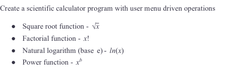
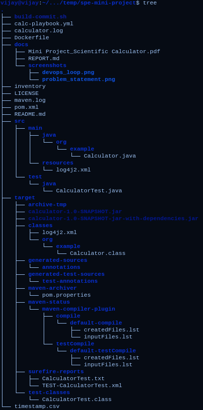

## SPE Miniproject Report
### Done by: IMT2019525 VIJAY JAISANKAR

---

### Quick links
- [Github Repo](https://github.com/vijay-jaisankar/spe-mini-project)
- [Docker image on Dockerhub](https://hub.docker.com/repository/docker/thehungrypigeon/calc/general)
- [Maven Package](https://github.com/vijay-jaisankar/spe-mini-project/packages/1818916)

--- 
### Problem statement


More details about the problem statement can be found in [this](./Mini%20Project_Scientific%20Calculator.pdf) document.

---
### DevOps
**About DevOps**  
[DevOps](https://www.atlassian.com/devops) is a set of practices, tools, and a cultural philosophy that automate and integrate the processes between software development and IT teams.   
The main aspects of DevOps are 
- Team empowerment
- Cross-team communication and collaboration
- Technology automation 

This way of working bridges the gap between the Development and Operations team and leverages each others' strengths. The entire team works across the entire application lifecycle, as indicated in the following diagram:   


**Benefits of DevOps**
There are many benefits of adopting this working model, here are the most relevant benefits to our use case
- Faster and better product delivery
    - This enables safe agility 
- Faster issue resolution
    - This was manifested in the user friendly tooling and CI pipeline
- Greater automation
    - This helped reduce the grunt work of pushing to package managers and running tests manually.

---
### Tools used
- Git
    - This is a distributed VCS, we used Github issues and commits to track progress of changes made to files 
- JUnit
    - This is a unit testing framework for Java projects, this was used to test the four calculator functions
- Maven
    - This is a build automation tool that installs dependencies and can be used to deploy Java projects easily
- Github Actions
    - This is a web-based CI tool that can perform actions and commands on the codebase at predefined times.
- Docker
    - This is a containerisation platform that packages projects into lightweight containers
- Ansible
    - This is a configuration management tool that automates deployment infrastructure management
- CodeQL
    - This is a Github service that raises security issues with committed code.
- ELK
    - This is a search and analytics engine that produces visualisations and insights into the generated log files
- Log4J
    - This is a Java library that generated said log files with a predefined syntax

---
### Project structure
  
This is the structure of the project. We can see that the Java code itself resides in `Calculator.java` and the tests are in `CalculatorTest.java`.   
`pom.xml` and `log4j2.xml` are configuration files for the Maven build process and the logger respectively.
The `target` folder contains generated build artefacts of the project.  
The `Dockerfile` contains containerisation instructions and `calc-playbook.yml` and `inventory` are used in setting up a local instance using Ansible.

---
### Code snippets
  

We can see the key aspects of the code
- Checking for edge cases
- Computation of the required functionality
- Logging of the inputs and outputs
---


There are three test cases for each functionality
- Positive case
- Edge case
- Case to check the precision of the generated output

---
### Maven build process
  

This is the `pom.xml` file that lists the properties, dependencies, plugins, and repositories intended for the project. As we can see, Log4J, Maven assembly, and Github packages have been integrated into this project.  

The project is cleaned, built, and tested as follows:
```
mvn clean install test --log-file maven.log
```

This generates a log file, where we can see warnings and the build status:


---
### Docker build and run
  

This is the dockerfile that is used to generate a container with the jar file. We can build the image as follows:


It can then be run with 
```
docker run -it ... # Created ID of the image 
```

  

The image can also be pulled run via Dockerhub - this step will be explained later on in the report.

---
### Logging
  
This file defines the configuration for Log4J - more specifically, the format and syntax of the generated logs. Here are the logs generated while running the test cases:  
  

We can then analyse these logs with ELK's Kibana. On selecting the index as the timestamp, the following graph is generated.
  

The graph can then be exported to a CSV.  


---
### Contributing to the repository
We have included a simple shell script to build the project, sync changes and push them to the repository  


We also use [conventional commits](https://www.conventionalcommits.org/en/v1.0.0/#summary) and track progress through [issues](https://github.com/vijay-jaisankar/spe-mini-project/issues).

---
### Github actions
This is the meat and potatoes of this project. Let us look at the main workflows of this project:

  
As indicated in the comments, this action runs on every push and PR to the main repo. 
- It first checkout the code in a local Github container running Ubuntu.
- Then, it sets up JDK 11 and builds and tests the project
- After that, it builds and push the generated Docker image to Dockerhub

We can see the status of the [run](https://github.com/vijay-jaisankar/spe-mini-project/actions/runs/4481078156/jobs/7877267558) here:

  

As alluded to earlier, the image can be pulled and run from Dockerhub.


The other workflow is [CodeQL](https://codeql.github.com/), which checks for vulnerabilities in the committed code.


We can see the status of the [run](https://github.com/vijay-jaisankar/spe-mini-project/actions/runs/4481078154/jobs/7877267514) here


---
### Ansible
This is the primary tool to be used to run the project locally. 


As indicated here, the project is destined to run on the localhost.  
This is the playbook file that is used to configure and pull the project.
  

As indicated in the image, we pull and run the image from Dockerhub. Here is the output when this is run locally:


---
### Github - intricacies

#### Releases
We can release the project using Github releases.  
  

There is an underlying Github action that pushes the Maven package to Github packages, which is configured as follows:
  

All packages for this project can be found [here](https://github.com/vijay-jaisankar?tab=packages&repo_name=spe-mini-project).

#### Issue tracking
We track pending tasks through issues and link commits to them.

